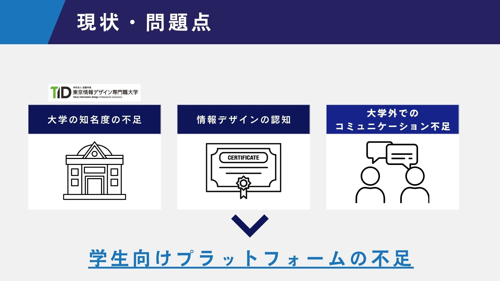
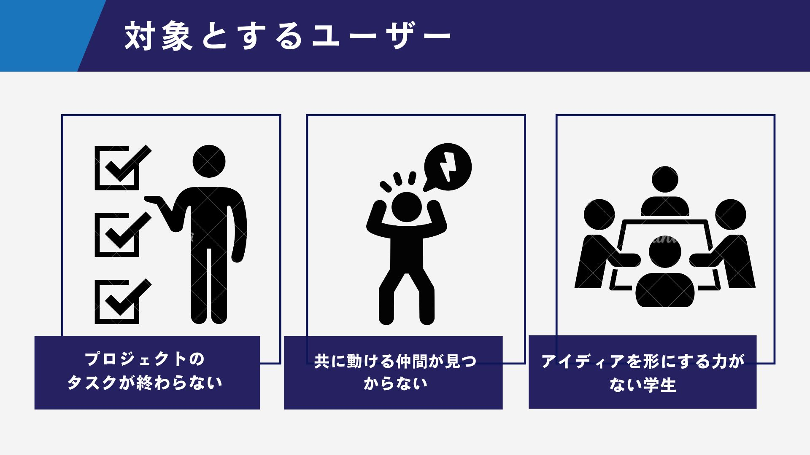
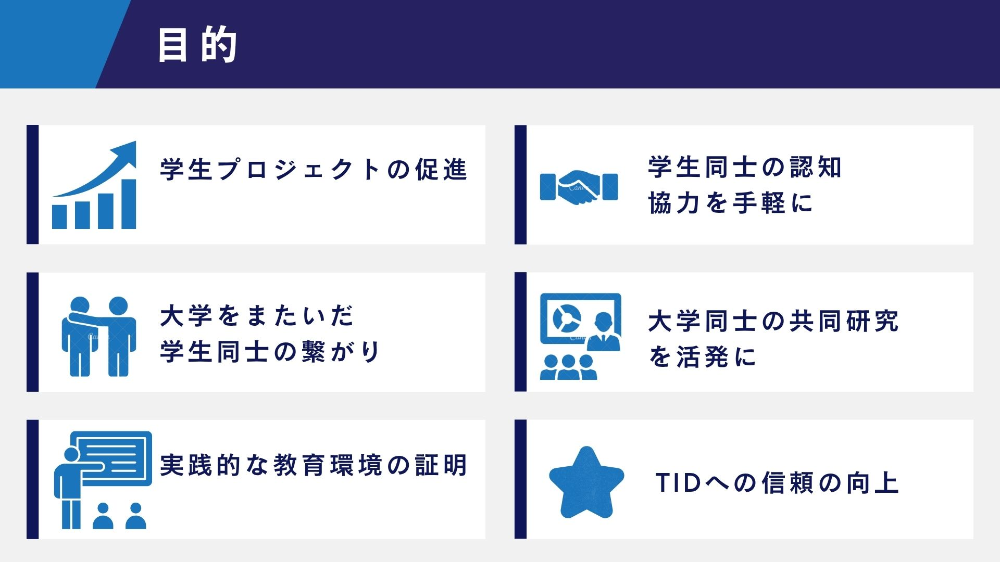
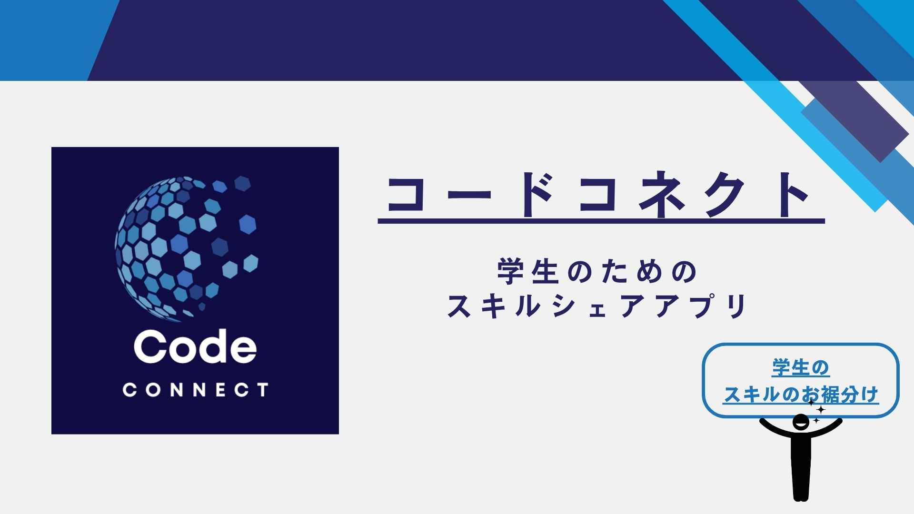

# ポートフォリオ - Rinka

## 🌟 概要
デジタルファブリケーション、メディアアート、UI/UX改善、ツール開発を通して、  
「アイデアを形にする力」を磨いてきました。After EffectsやFigma、Unity、Blenderなど  
複数のプロトタイピングツールを扱い、抽象的なコンセプトも可視化・実装まで行います。

---

## 💡 1. Blender Add-on Tool【画像エフェクト生成ツール】

### ▶ 概要
非デザイナーでも、画像を選択→ボタン一つでエフェクトを生成できるアドオンを制作。  
スパイラル状や円形に画像を配置し、AfterEffects風のループアニメーションを出力できます。

- 自己学習 → 実装 → UI改善まで一貫して担当
- 技術：Python（Blender API）、GUI設計
- [GitHub リンク](https://github.com/your-username/blender-addon)  
- 

---

## 🎮 2. Unityゲーム試作（認知脳トレゲーム）

- Unity/C#：2年　認知脳トレゲームを開発
- SQLiteでスコア保存・ランキング機能も実装
- [GitHubリンク](https://unityroom.com/games/kaitou_final)

---

## 🎨 3. UI/UX改善プロジェクト【Figma・デザイン思考】

#### ▶ 概要

#### ▶ 文脈と課題の背景

#### ▶ ニーズ・インサイト

#### ▶ 実施内容と成果

#### ▶ 成果物
- [アプリのURLはこちら](https://v0.dev/chat/student-skill-sharing-app-iFlI2Q3qB5G)

## 🛠 スキルセット

| 分野                   | ツール・技術                                                                 |
|------------------------|------------------------------------------------------------------------------|
| ソフトウェア開発         | Python（2年）/ C/C++（2年・簡易ゲーム制作）/ C# / JavaScript / Node.js / Socket.io |
| 画像処理・解析          | OpenCV（1年）                                                               |
| デジタルファブリケーション | Blender（2年・エフェクトツール制作） / Unity（2年・ゲーム制作）                   |
| UI/UXデザイン          | Figma（プロトタイプ制作・UI改善） / デザイン思考 / UX設計                          |
| メディアアート・映像制作    | After Effects（編集・演出・リーダー経験あり） / Animate（教育アプリ用）             |
| Web・仮想環境構築       | Linux / AWS / SQL / Socket.io / WebSocket / 仮想サーバ構築                          |
| データベース             | SQLite（スコア保存・ランキング機能）                                            |

---
